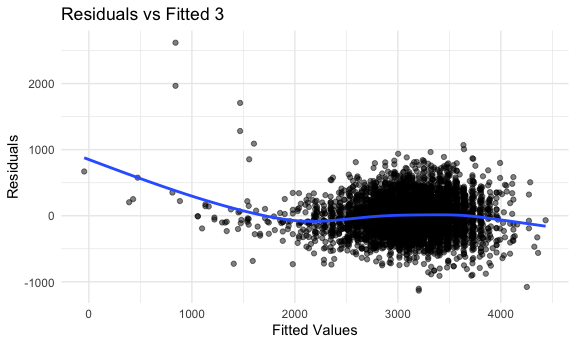

tz2472\_hw6
================
tianwei zhao
12/3/2021

``` r
library(tidyverse)
```

    ## ── Attaching packages ─────────────────────────────────────── tidyverse 1.3.1 ──

    ## ✓ ggplot2 3.3.5     ✓ purrr   0.3.4
    ## ✓ tibble  3.1.4     ✓ dplyr   1.0.7
    ## ✓ tidyr   1.1.3     ✓ stringr 1.4.0
    ## ✓ readr   2.0.1     ✓ forcats 0.5.1

    ## ── Conflicts ────────────────────────────────────────── tidyverse_conflicts() ──
    ## x dplyr::filter() masks stats::filter()
    ## x dplyr::lag()    masks stats::lag()

``` r
library(modelr)

knitr::opts_chunk$set(
  fig.width = 6,
  fig.asp = .6,
  out.width = "90%"
)
theme_set(theme_minimal() + theme(legend.position = "bottom"))
options(
  ggplot2.continuous.colour = "viridis",
  ggplot2.continuous.fill = "viridis"
)
scale_colour_discrete = scale_color_viridis_d
scale_fill_discrete = scale_fill_viridis_d
```

## Problem 1

``` r
birth_weight = 
  read_csv("birthweight.csv")
```

    ## Rows: 4342 Columns: 20

    ## ── Column specification ────────────────────────────────────────────────────────
    ## Delimiter: ","
    ## dbl (20): babysex, bhead, blength, bwt, delwt, fincome, frace, gaweeks, malf...

    ## 
    ## ℹ Use `spec()` to retrieve the full column specification for this data.
    ## ℹ Specify the column types or set `show_col_types = FALSE` to quiet this message.

First, convert appropriate variables to factors

``` r
birth_weight =
  birth_weight %>% 
  mutate(
    babysex = recode_factor(babysex, "1" = "male", "2" = "female"),
    frace = recode_factor(frace, "1" = "White", "2" = "Black", "3" = "Asian", "4" = "Puerto Rican", "8" = "Other", "9" = "Unkown"),
    mrace = recode_factor(mrace, "1" = "White", "2" = "Black", "3" = "Asian", "4" = "Puerto Rican", "8" = "Other"),
    malform = recode_factor(malform, "0" = "absent", "1" = "present" )
  )
```

Summary of the data set before further analysis

``` r
skimr::skim(birth_weight) %>% 
  select(-c(factor.ordered, factor.n_unique, factor.top_counts,numeric.hist)) %>% 
  knitr::kable()
```

| skim\_type | skim\_variable | n\_missing | complete\_rate | numeric.mean |  numeric.sd | numeric.p0 | numeric.p25 | numeric.p50 | numeric.p75 | numeric.p100 |
|:-----------|:---------------|-----------:|---------------:|-------------:|------------:|-----------:|------------:|------------:|------------:|-------------:|
| factor     | babysex        |          0 |              1 |           NA |          NA |         NA |          NA |          NA |          NA |           NA |
| factor     | frace          |          0 |              1 |           NA |          NA |         NA |          NA |          NA |          NA |           NA |
| factor     | malform        |          0 |              1 |           NA |          NA |         NA |          NA |          NA |          NA |           NA |
| factor     | mrace          |          0 |              1 |           NA |          NA |         NA |          NA |          NA |          NA |           NA |
| numeric    | bhead          |          0 |              1 |   33.6508521 |   1.6205809 |   21.00000 |    33.00000 |    34.00000 |     35.0000 |     41.00000 |
| numeric    | blength        |          0 |              1 |   49.7505758 |   2.7234033 |   20.00000 |    48.00000 |    50.00000 |     51.0000 |     63.00000 |
| numeric    | bwt            |          0 |              1 | 3114.4039613 | 512.1540963 |  595.00000 |  2807.00000 |  3132.50000 |   3459.0000 |   4791.00000 |
| numeric    | delwt          |          0 |              1 |  145.5720866 |  22.2078148 |   86.00000 |   131.00000 |   143.00000 |    157.0000 |    334.00000 |
| numeric    | fincome        |          0 |              1 |   44.1052510 |  25.9756806 |    0.00000 |    25.00000 |    35.00000 |     65.0000 |     96.00000 |
| numeric    | gaweeks        |          0 |              1 |   39.4262552 |   3.1545380 |   17.70000 |    38.30000 |    39.90000 |     41.1000 |     51.30000 |
| numeric    | menarche       |          0 |              1 |   12.5142791 |   1.4776703 |    0.00000 |    12.00000 |    12.00000 |     13.0000 |     19.00000 |
| numeric    | mheight        |          0 |              1 |   63.4930907 |   2.6564518 |   48.00000 |    62.00000 |    63.00000 |     65.0000 |     77.00000 |
| numeric    | momage         |          0 |              1 |   20.2991709 |   3.8778985 |   12.00000 |    18.00000 |    20.00000 |     22.0000 |     44.00000 |
| numeric    | parity         |          0 |              1 |    0.0023031 |   0.1029142 |    0.00000 |     0.00000 |     0.00000 |      0.0000 |      6.00000 |
| numeric    | pnumlbw        |          0 |              1 |    0.0000000 |   0.0000000 |    0.00000 |     0.00000 |     0.00000 |      0.0000 |      0.00000 |
| numeric    | pnumsga        |          0 |              1 |    0.0000000 |   0.0000000 |    0.00000 |     0.00000 |     0.00000 |      0.0000 |      0.00000 |
| numeric    | ppbmi          |          0 |              1 |   21.5703695 |   3.1821097 |   13.07137 |    19.52637 |    21.02642 |     22.9106 |     46.09639 |
| numeric    | ppwt           |          0 |              1 |  123.4905573 |  20.1612659 |   70.00000 |   110.00000 |   120.00000 |    134.0000 |    287.00000 |
| numeric    | smoken         |          0 |              1 |    4.1451808 |   7.4075499 |    0.00000 |     0.00000 |     0.00000 |      5.0000 |     60.00000 |
| numeric    | wtgain         |          0 |              1 |   22.0815292 |  10.9445119 |  -46.00000 |    15.00000 |    22.00000 |     28.0000 |     89.00000 |

As we can observe from the table, there’s no missing value in the data
set. Moreover, pnumlbw and pnumgsa are 0 for all of their observations,
therefore those variables should be not used in the regression analysis.

Hypothesized Regression Model

Hypothesize a model using the step-wise approach that we learned in
Biostatistical Method I!

Here, I used the step-wise regression function in R. The process is to
start with a model using all predictors and then use the backward
elimination process to search through models from full to null to find
the model with the smallest AIC value.

``` r
mod_1 = lm(bwt ~ ., data = birth_weight) %>% 
  step(direction = "backward", trace = 0)

mod_1
```

    ## 
    ## Call:
    ## lm(formula = bwt ~ babysex + bhead + blength + delwt + fincome + 
    ##     gaweeks + mheight + mrace + parity + ppwt + smoken, data = birth_weight)
    ## 
    ## Coefficients:
    ##       (Intercept)      babysexfemale              bhead            blength  
    ##         -6098.822             28.558            130.777             74.947  
    ##             delwt            fincome            gaweeks            mheight  
    ##             4.107              0.318             11.592              6.594  
    ##        mraceBlack         mraceAsian  mracePuerto Rican             parity  
    ##          -138.792            -74.887           -100.678             96.305  
    ##              ppwt             smoken  
    ##            -2.676             -4.843

So, the first model that I hypothesize with backward elimination include
11 variables. Those variables are babysex,bhead,blength,delwt,fincome,
gaweeks,mheight, mrace, parity, ppwt, and smoken.

``` r
summary(mod_1) %>% 
  broom::tidy() %>% 
  select(term, estimate, p.value) %>%
  knitr::kable(digits = 3)
```

| term              |  estimate | p.value |
|:------------------|----------:|--------:|
| (Intercept)       | -6098.822 |   0.000 |
| babysexfemale     |    28.558 |   0.001 |
| bhead             |   130.777 |   0.000 |
| blength           |    74.947 |   0.000 |
| delwt             |     4.107 |   0.000 |
| fincome           |     0.318 |   0.069 |
| gaweeks           |    11.592 |   0.000 |
| mheight           |     6.594 |   0.000 |
| mraceBlack        |  -138.792 |   0.000 |
| mraceAsian        |   -74.887 |   0.077 |
| mracePuerto Rican |  -100.678 |   0.000 |
| parity            |    96.305 |   0.017 |
| ppwt              |    -2.676 |   0.000 |
| smoken            |    -4.843 |   0.000 |

Plot of model residuals against fitted values

``` r
birth_weight %>% 
  add_predictions(mod_1) %>% 
  add_residuals(mod_1) %>%
  ggplot(aes(x = pred, y = resid)) +
  geom_point(alpha = 0.5) + 
  geom_smooth(se = FALSE) +
  labs(x = "Fitted Values", y = "Residuals",title = "Residuals vs Fitted 1")
```

    ## `geom_smooth()` using method = 'gam' and formula 'y ~ s(x, bs = "cs")'


From the plot, we can see that most of the residuals bounce around 0 in
the (-1000,1000) horizontal band. However, there are some concerning
points at the lower end of the plot with high residuals.

Compare models

``` r
mod_2 = lm(bwt ~ blength + gaweeks, data = birth_weight)
mod_3 = lm(bwt ~ bhead + blength + babysex + 
             bhead * blength + 
             bhead * babysex + 
             blength * babysex + 
             bhead * blength * babysex, data = birth_weight)
```

Residual vs Fitted plot for the second model

``` r
birth_weight %>% 
  add_predictions(mod_2) %>% 
  add_residuals(mod_2) %>%
  ggplot(aes(x = pred, y = resid)) +
  geom_point(alpha = 0.5) + 
  geom_smooth(se = FALSE) +
  labs(x = "Fitted Values", y = "Residuals",title = "Residuals vs Fitted 2")
```

    ## `geom_smooth()` using method = 'gam' and formula 'y ~ s(x, bs = "cs")'


Residual vs Fitted plot for the second model

``` r
birth_weight %>% 
  add_predictions(mod_3) %>% 
  add_residuals(mod_3) %>%
  ggplot(aes(x = pred, y = resid)) +
  geom_point(alpha = 0.5) + 
  geom_smooth(se = FALSE) +
  labs(x = "Fitted Values", y = "Residuals",title = "Residuals vs Fitted 3")
```

    ## `geom_smooth()` using method = 'gam' and formula 'y ~ s(x, bs = "cs")'



Cross Validation

``` r
cv_df = crossv_mc(birth_weight, 100) 

cv_df =
  cv_df %>% 
  mutate(
    train = map(train, as_tibble),
    test = map(test, as_tibble))

cv_df = 
  cv_df %>% 
  mutate(
    mod_1 = map(train, ~lm(bwt ~ babysex + bhead + blength + delwt + fincome + gaweeks + mheight + mrace + parity + ppwt + smoken, data = .x)),
    mod_2 = map(train, ~lm(bwt ~ blength + gaweeks, data = .x)),
    mod_3 = map(train, ~lm(bwt ~ bhead + blength + babysex + 
               bhead * blength + bhead * babysex + blength * babysex + 
               bhead * blength * babysex, data = .x))
  ) %>% 
  mutate(
    rmse_mod_1 = map2_dbl(mod_1, test, ~rmse(model = .x, data = .y)),
    rmse_mod_2 = map2_dbl(mod_2, test, ~rmse(model = .x, data = .y)),
    rmse_mod_3 = map2_dbl(mod_3, test, ~rmse(model = .x, data = .y)))
```

    ## Warning in predict.lm(model, data): prediction from a rank-deficient fit may be
    ## misleading

``` r
cv_df %>% 
  select(starts_with("rmse")) %>% 
  pivot_longer(
    everything(),
    names_to = "model", 
    values_to = "rmse",
    names_prefix = "rmse_") %>% 
  mutate(model = fct_inorder(model)) %>% 
  ggplot(aes(x = model, y = rmse)) + geom_violin()
```


From the plot, we can see that the first model, the one I hypothesized
using the step-wise regression in backward direction, has the smallest
RMSE overall. Therefore, the first model is a better fit out of the
three models. On the other hand, Model 2, the one with the main effects,
has the highest RMSE, which means that it did not the best in fitting
the data.

## Problem 2

``` r
weather_df = 
  rnoaa::meteo_pull_monitors(
    c("USW00094728"),
    var = c("PRCP", "TMIN", "TMAX"), 
    date_min = "2017-01-01",
    date_max = "2017-12-31") %>%
  mutate(
    name = recode(id, USW00094728 = "CentralPark_NY"),
    tmin = tmin / 10,
    tmax = tmax / 10) %>%
  select(name, id, everything())
```

    ## Registered S3 method overwritten by 'hoardr':
    ##   method           from
    ##   print.cache_info httr

    ## using cached file: ~/Library/Caches/R/noaa_ghcnd/USW00094728.dly

    ## date created (size, mb): 2021-10-09 22:26:23 (7.604)

    ## file min/max dates: 1869-01-01 / 2021-10-31

Boot Strap

Bootstrap and find the values of r̂2 and
$log(\\hat{\\beta\_{0}\* \\beta\_{1}})$ for each strap.

``` r
set.seed(1)

boot_straps =
  weather_df %>% 
  modelr::bootstrap(n = 5000, id = "strap_id") %>% 
  mutate(
    strap = map(strap,as_tibble),
    models = map(strap, ~lm(tmax ~ tmin, data = .x)),
    results = map(models, broom::tidy),
    summary = map(models, broom::glance)
    ) %>% 
  unnest(c(results,summary),names_repair = "universal")
```

    ## New names:
    ## * statistic -> statistic...7
    ## * p.value -> p.value...8
    ## * statistic -> statistic...12
    ## * p.value -> p.value...13

``` r
parameter_est = 
  boot_straps %>% 
  select(strap_id, term, estimate, r.squared) %>% 
  pivot_wider(
    names_from = "term",
    values_from = "estimate"
  ) %>% 
  rename(
    r_squared = r.squared,
    b0 = `(Intercept)`,
    b1 = tmin
  ) %>% 
  mutate(log_product = log(b0 * b1)) %>% 
  select(-c(b0,b1))
```

Plot the distribution of the interested quantities

r̂2 distribution plot

``` r
parameter_est %>%
  ggplot(aes(x = r_squared)) +
  geom_density() +
  labs(
    title = "Distribution of R^2")
```


The r̂2 falls in the range between 0.874, 0.937. From the plot, we can
see that r̂2 is roughly normal distributed with a mean of 0.911, and
standard deviation 0.009.

2.  log(β̂0 \* β̂1) distribution plot

``` r
parameter_est %>%
  ggplot(aes(x = log_product)) +
  geom_density() +
  labs(
    x = "log(b0 * b1)",
    title = "Distribution of log(b0 * b1)")
```


The log(β̂0 * β̂1) falls in the range between 1.922, 2.102.From the plot,
we can see that log(β̂0 * β̂1) appears to be normally distributed with a
mean of 2.013 and standard deviation 0.024

95% confidence interval for the interested quantities

1.  r̂2 95% Confidence Interval

``` r
quantile(pull(parameter_est, r_squared), probs = c(0.025,0.975))
```

    ##      2.5%     97.5% 
    ## 0.8936684 0.9271060

The 95% confidence of r̂2 is (0.89,0.93)

2.  log(β̂0 \* β̂1) 95% Confidence Interval

``` r
quantile(pull(parameter_est, log_product), probs = c(0.025,0.975))
```

    ##     2.5%    97.5% 
    ## 1.964949 2.058887

The 95% confidence of log(β̂0 \* β̂1) is (1.96,2.06)
